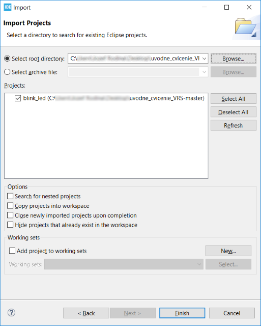

# Vnorené sytémy - Cvičenie 1
## Ciele cvičenia ##
1. Inštalácia vývojového prostredia STM32CubeIDE
2. Oboznámanie sa s vývojovým prostredím
3. Oboznámenie sa s vývojovým HW
4. Stiahnutie a rozbehanie vzorového príkladu
5. Oboznámenie sa s vývojom a debugovaním na MCU
6. Úprava aplikácie
## 1. Inštalácia vývojového prostredia STM32CubeIDE ##
- inštalácia z inštalačného súboru, ktorý sa nachádza na USB kľučoch, tý čo majú iný OS si môžu stiahnúť inštalátor z tejto stránky <https://www.st.com/en/development-tools/stm32cubeide.html#get-software> (nutná registrácia na stránke)
- inštalácia prebieha štandardne, pri výbere komponentov, ktoré sa budú inštalovať sa môže odznačiť “SEGGER J-link” (nepotrebujeme to)
***Inštalátor a cele vývojove prostredie nevie pracovať z priečinkov, ktorých absolútna cesta obsahuje medzeru, alebo diakritiku***
## 2. Práca s vyvojovým prostredím ##
- import existujúceho projektu do workspace
> FILE -> IMPORT -> EXISTING PROJECTS INTO WORKSPACE -> SELECT ROOT DIRECTORY -> FINISH

